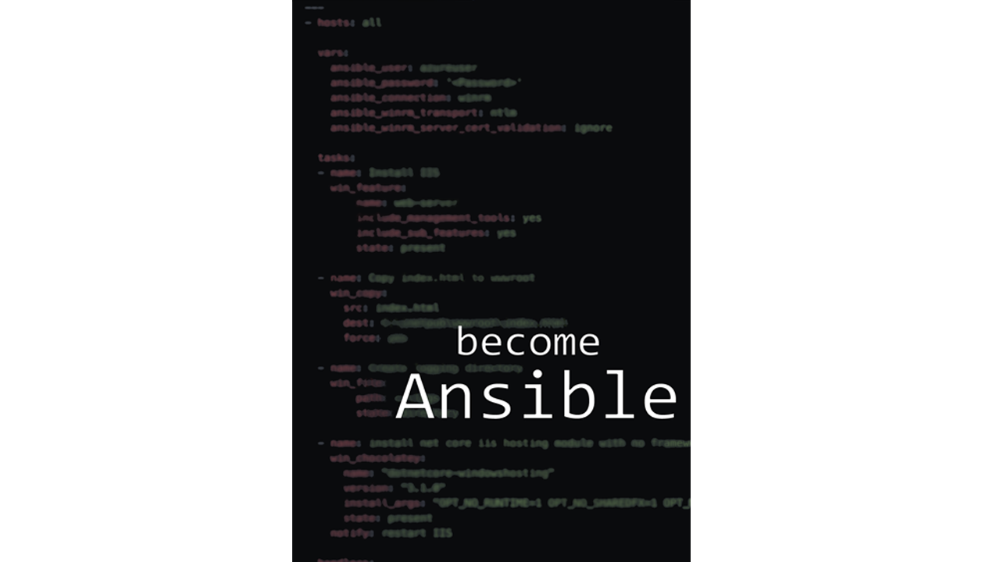

Start as a beginner, leave production-ready. Build a container-centric Ansible development environment and crawl, walk, run, sprint your way through learning Ansible. You’ll start by running ad-hoc Ansible commands and by the end you’ll be deploying Ansible with commits and pull requests! become Ansible was forged through years of experience as an engineering team learned and implemented Ansible in an organization. It shares all those learned the hard way lessons with you in under 140 pages. You don’t need a cryptic tome, you need a player’s guide.

**Contents**

* Preface
* About the book
* **Part 1: Setup an Ansible Environment**
* Ansible Development with Containers
* Connect to the Cloud
* Deploy an Ansible Dev Environment
* **Part 2: become Ansible**
* Starting at the Source
* Using Ad-hoc Ansible Commands
* What is Repeated is a Playbooks
* Take Inventory of the Infrastructure
* Building Reusable Configurations 
* Dynamic Inventories for Scaling
* Build a CI \ CD pipeline for Ansible with Github Actions

**Praise for become Ansible**

> "To become Ansible is to become part of something larger. It is to derive value from the combination of many tools and processes. To become Ansible is to be a sysadmin with an array of technologies at your disposal. What can you build with an array of tools? Anything. Everything." Read the full review [here](https://murrahjm.github.io/become-ansible-review/).
>
>--- Jeremy Murrah (@JeremyMurrah)

>"You'll be very hard-pressed to find a more current, complete way to learn Ansible than become Ansible"
>--- Rich Highness (@rhighness)

>"Most coding books stick with a single platform. become Ansible takes Ansible and shows you how to use it EVERYWHERE! It's your one-stop-shop to Ansible"
>--- Michael Levan (@TheNJDevOpsGuy)

>"Being a novice or with no prior experience in Ansible, the book's style of providing practical examples at every stage gave me a quick booster to start my Ansible journey."
>--- Gnaneshwar Babu (@mail2gnana)

>"become Ansible is written in such a way that you are guided in a purposeful manner to achieve tangible tasks, solidifying the knowledge that you are learning as you progress through the book. It is one of the most interactive technical books I’ve had the pleasure of reading."
>--- Matt Allford (@mattallford)

>"A must-have book for every SRE out there who loves ansible & awscloud!"
>--- Marcos Ortiz (@marcosluis2186)